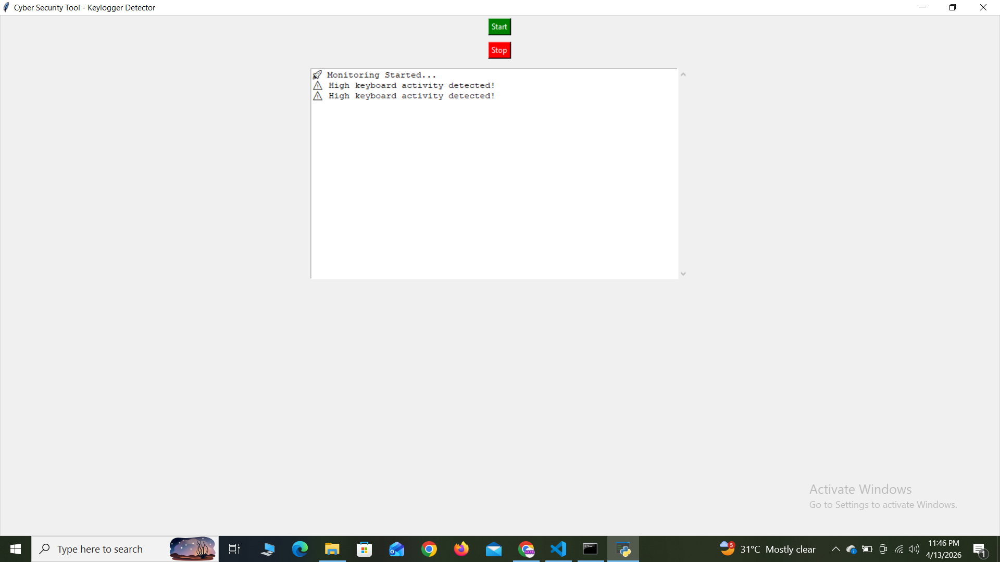

# CyberSecurity--Keylogger-Detector
A Python-based cybersecurity tool to detect suspicious keyboard activity and potential keyloggers using real-time monitoring and GUI.

CyberSecurity - Keylogger Detector

Overview
A Python-based cybersecurity tool that detects suspicious keyboard activity and potential keyloggers using real-time monitoring and a graphical interface.

Features
- Real-time keyboard monitoring
- Detects suspicious keystroke patterns
- GUI-based interface (Start/Stop control)
- Lightweight and easy to use
- Helps identify potential keylogger behavior

Technologies Used
- Python
- Tkinter (GUI)
- pynput (keyboard monitoring)

How to Run
1. Install dependencies:
pip install pynput
2. Run the tool:
python main.py

Demo

Author 
MOHD EHSAN MUZAMMIL

Mohd Ehsaan
